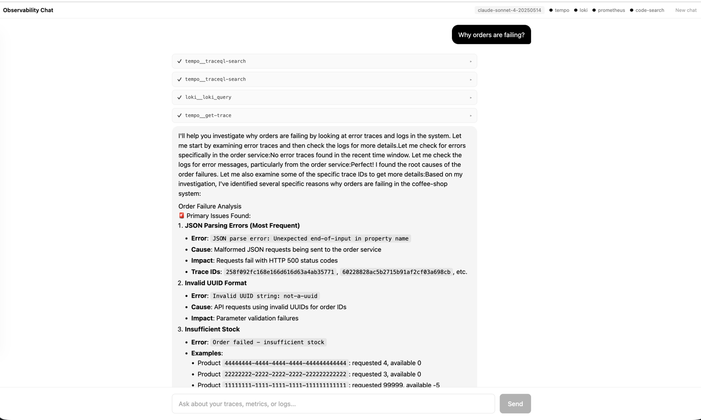
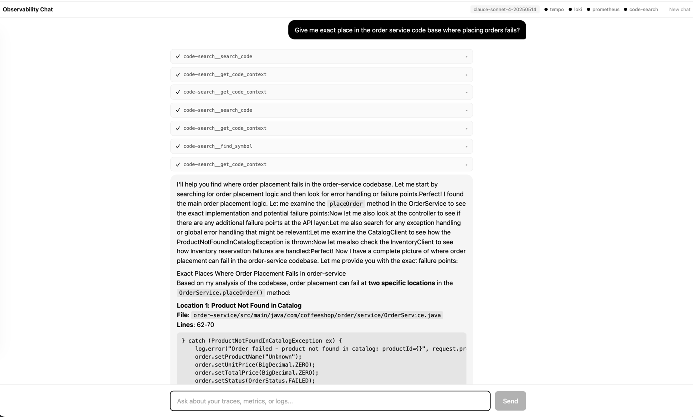

# Coffee Shop — Observability meets AI

A demo project showing how to connect the three pillars of OpenTelemetry (traces, metrics, logs) to an AI agent, giving
you the ability to query and talk with your platform instrumentation using natural language. 





## Quick Start

```bash
docker compose up --build
```

This starts the entire stack: application services, observability infrastructure, and the AI chat agent.

## Architecture

### Application Services (Spring Boot + OTEL auto-instrumentation)

| Service             | Port | Description                                  |
|---------------------|------|----------------------------------------------|
| `catalog-service`   | 8081 | Product catalog                              |
| `inventory-service` | 8083 | Stock management                             |
| `order-service`     | 8082 | Order processing (calls catalog & inventory) |

### Observability Stack

| Component      | Port | Role                                        |
|----------------|------|---------------------------------------------|
| OTel Collector | 4317 | Receives traces, metrics, and logs via OTLP |
| Prometheus     | 9090 | Metrics storage & querying                  |
| Tempo          | 3200 | Distributed trace storage                   |
| Loki           | 3100 | Log aggregation                             |
| Grafana        | 3000 | Dashboards (anonymous admin access)         |

### AI Chat Agent

| Component            | Port | Role                                                      |
|----------------------|------|-----------------------------------------------------------|
| `observability-chat` | 8084 | Chat UI + backend that queries observability data via MCP |

The AI agent connects to backends through [MCP (Model Context Protocol)](https://modelcontextprotocol.io/)
servers, allowing it to retrieve traces, metrics, logs, and code on your behalf and answer questions about system
behavior in plain English.

### Code Search (MCP)

| Component         | Port | Role                                         |
|-------------------|------|----------------------------------------------|
| `code-search`     | 8090 | Semantic code search MCP server              |
| `qdrant`          | 6333 | Vector database for code embeddings          |
| `jina-embeddings` | —    | Embedding model (Jina Code V2 via HF TEI)   |

The code-search MCP server indexes the project's microservices using tree-sitter for symbol extraction and Jina Code V2
for vector embeddings, stored in Qdrant. It exposes MCP tools for semantic search, symbol lookup, usage finding, and
code context retrieval — enabling the AI agent to navigate and reason about the codebase alongside observability data.

Indexed services and their languages are configured in [`code-search/config.yaml`](code-search/config.yaml).

## Generating Traffic

```bash
./generate-success-traffic.sh
./generate-error-traffic.sh
```

## Prerequisites

- Docker & Docker Compose
- An API key for the LLM provider (configured in `observability-chat/.env.example`)
