# Coffee Shop: Observability, MCPs & AI Agents

Excalidraw: https://excalidraw.com/#json=tDw5wf64-4Ns3Dwo5mdtV,rW21pxrC5MEW5TLzKMzoTA

---

## Agenda

1. **Observability** — OpenTelemetry and the 3 Pillars
2. **MCPs** — Model Context Protocol: Host, Client, Servers
3. **AI Agents** — The Agent Loop and Why It Matters

---

# Part 1: Observability with OpenTelemetry

---

## What is Observability?

Observability is the ability to understand **what is happening inside a system** by looking at its outputs — without having to deploy new code or reproduce bugs.

Think of it like a doctor's toolkit:
- **Logs** = Patient's medical history (what happened)
- **Metrics** = Vital signs monitor (heart rate, temperature — is something abnormal?)
- **Traces** = MRI scan (follow the full path of a request through the body)

Together, they let you **diagnose problems fast** — often in minutes instead of hours.

---

## The 3 Pillars of Observability

### Traces
A **trace** follows a single request as it travels across multiple services. Each step in the journey is called a **span**.

Example: "Place Order" trace:
```
order-service (200ms total)
  ├── GET catalog-service/api/products/42   (30ms)
  ├── POST inventory-service/api/reserve    (45ms)
  └── INSERT into orders table              (15ms)
```

Traces answer: **Where did the time go? Which service is slow? Where did the error happen?**

### Metrics
**Metrics** are numerical measurements over time — counters, gauges, histograms.

Examples:
- HTTP request rate: 150 req/s
- P95 latency: 230ms
- Error rate: 2.3%
- JVM memory usage: 256MB

Metrics answer: **Is the system healthy right now? Are things getting worse?**

### Logs
**Logs** are timestamped text messages from the application.

Examples:
- `INFO  order-service: Order created for product 42, quantity 2`
- `ERROR inventory-service: Insufficient stock for product 42`

Logs answer: **What exactly happened? What was the error message?**

---

## OpenTelemetry (OTEL)

**OpenTelemetry** is an open-source, vendor-neutral standard for collecting all three signals (traces, metrics, logs) from your applications.

Key idea: **Instrument once, send to any backend** — Grafana, Datadog, New Relic, Jaeger, etc.

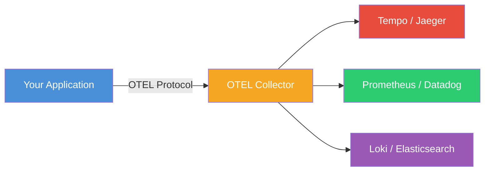

---

## OpenTelemetry Java Agent

The **OTEL Java Agent** is a JAR file that you attach to any Java application at startup. It **automatically instruments** your code — no code changes needed.

### How it works

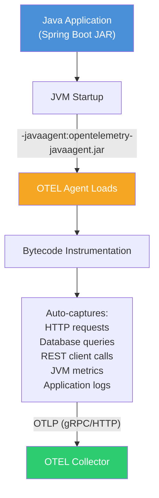

### What gets auto-instrumented
- **HTTP server** spans (every incoming request)
- **HTTP client** spans (every outgoing REST call)
- **Database** spans (every SQL query via JDBC/Hibernate)
- **JVM metrics** (memory, GC, threads, connection pools)
- **Logs** (SLF4J/Logback are captured and enriched with trace context)

### Pros
- **Zero code changes** — just add the JAR at startup
- **Comprehensive** — covers HTTP, DB, messaging, gRPC, and more out of the box
- **Trace context propagation** — automatically links spans across services
- **Vendor neutral** — works with any OTLP-compatible backend
- **Community maintained** — backed by CNCF with wide industry adoption

### Cons
- **Startup overhead** — agent needs time to instrument bytecode (a few seconds)
- **Memory overhead** — small additional memory usage for span/metric buffers
- **Limited control** — auto-generated spans may not capture business-specific context
- **Version coupling** — agent version must be compatible with your libraries
- **"Magic"** — can be hard to debug when something goes wrong (invisible bytecode changes)

> In our app, we use **custom annotations** (`@WithSpan`) in the Order Service for business logic visibility, on top of auto-instrumentation.

### Alternatives to the Java Agent

The OTEL Java Agent isn't the only way to instrument Java applications. Here's how the main approaches compare:

| Approach | Code Changes | Startup Cost | Control | Cost / Overhead | Cloud Hosting Cost (AWS etc.) | Best For |
|----------|-------------|-------------|---------|----------------|-------------------------------|----------|
| **Java Agent** (runtime bytecode) | None | Higher (bytecode rewrite at startup) | Low — you get what the agent gives you | ~50-100MB extra memory, 3-10s slower startup, agent JAR versioning | **Highest** — generates the most telemetry data (every HTTP call, every DB query, every log). Trace ingestion is the main cost driver | Quick adoption, brownfield apps |
| **Spring Boot Starter** (`opentelemetry-spring-boot-starter`) | Minimal — add dependency + config | Low | Medium — configure via `application.yml` | Build dependency management, less library coverage than agent | **Medium-High** — similar data volume for Spring-covered libraries, but fewer auto-instrumented libs means fewer spans overall. Container size stays normal. ~10-20% less trace data than agent. | Spring Boot apps that want agent-free setup |
| **Manual SDK** (`opentelemetry-api` + `opentelemetry-sdk`) | High — instrument each call site | None | Full — you decide every span | High dev time to write & maintain, risk of missing spans, boilerplate in every service | **Lowest runtime** — you only emit what you explicitly instrument, so data volume is minimal. Near-zero container overhead. But **high engineering cost**: developer hours to instrument, review, and maintain. | Libraries, frameworks, fine-grained control |

> **The real cost isn't the instrumentation — it's the data.**
> Traces are by far the most expensive signal. A single HTTP request can generate 5-20 spans, each stored and indexed.

#### Spring Boot Starter (agent-free auto-instrumentation)
Uses Spring's own extension points (interceptors, filters) instead of bytecode manipulation. No `-javaagent` flag needed — just add the Maven/Gradle dependency. Trade-off: covers fewer libraries than the agent (mostly Spring-specific).

#### Manual SDK
You write the instrumentation yourself using the OpenTelemetry API:
```java
Tracer tracer = GlobalOpenTelemetry.getTracer("order-service");
Span span = tracer.spanBuilder("placeOrder").startSpan();
try (Scope scope = span.makeCurrent()) {
    // your business logic
    span.setAttribute("order.product_id", productId);
} finally {
    span.end();
}
```
Maximum control, but significantly more code to write and maintain.

---

## How Coffee Shop Uses OTEL

Three Spring Boot microservices, each with the Java Agent attached via Dockerfile:

```dockerfile
# Every service Dockerfile includes:
ADD https://github.com/.../opentelemetry-javaagent.jar /app/opentelemetry-javaagent.jar
ENV JAVA_TOOL_OPTIONS="-javaagent:/app/opentelemetry-javaagent.jar"
```

Configuration is purely via environment variables:
```
OTEL_SERVICE_NAME: order-service
OTEL_EXPORTER_OTLP_ENDPOINT: http://otel-collector:4317
OTEL_EXPORTER_OTLP_PROTOCOL: grpc
OTEL_METRICS_EXPORTER: otlp
OTEL_LOGS_EXPORTER: otlp
OTEL_TRACES_EXPORTER: otlp
```

---

## Complete Telemetry Data Flow

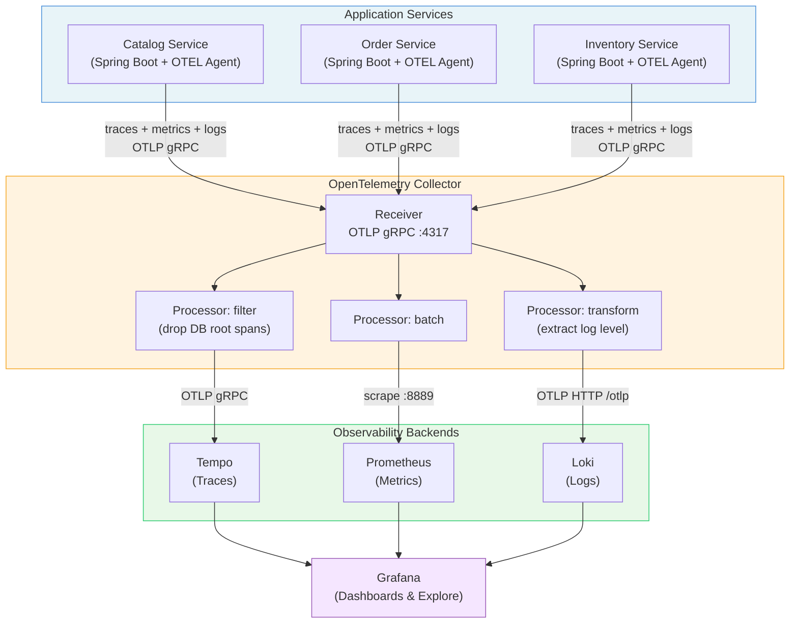

### OTEL Collector — The Traffic Router

The Collector receives **all** telemetry data and routes each signal type to the right backend:

| Signal | Processor | Exporter | Backend |
|--------|-----------|----------|---------|
| **Traces** | filter (drop DB root spans) + batch | OTLP gRPC | **Tempo** |
| **Metrics** | batch | Prometheus scrape endpoint | **Prometheus** |
| **Logs** | transform (extract log level) + batch | OTLP HTTP | **Loki** |

---

## Grafana — Connecting the Dots

Grafana doesn't just display data — it **links signals together**:

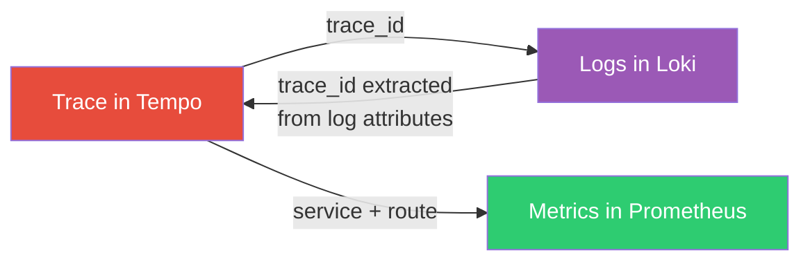

- From a **trace**, click to see the **logs** for that exact request
- From a **log line**, click the trace ID to see the **full trace**
- From a **trace**, see the **metrics** for that service and route

This cross-signal correlation is what makes observability powerful — you can jump from "what's slow?" (metrics) to "where's the bottleneck?" (traces) to "what's the error?" (logs) in seconds.

---

# Part 2: MCPs — Model Context Protocol

---

## What is MCP?

**MCP (Model Context Protocol)** is an open standard that lets AI models (like Claude or GPT) **use external tools** through a standardized interface.

Think of it like **USB for AI** — a universal plug that connects any AI model to any data source or tool.

Before MCP, every AI integration was custom. With MCP, you build a tool **once** and **any** AI model can use it.

---

## MCP Architecture — The Concepts

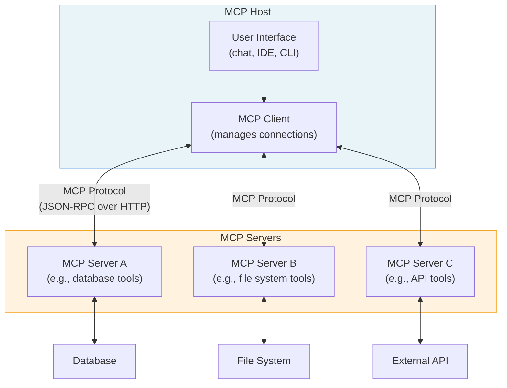

### Key Concepts

| Concept | What it is | Analogy |
|---------|-----------|---------|
| **Host** | The application that contains the AI model | Your computer |
| **Client** | Manages connections to MCP servers | USB controller |
| **Server** | Exposes tools and data to the AI | USB device |
| **Tool** | A specific action the AI can invoke | A function on the device |
| **Transport** | How messages are sent (HTTP, stdio, SSE) | The cable type |

### MCP Protocol Flow

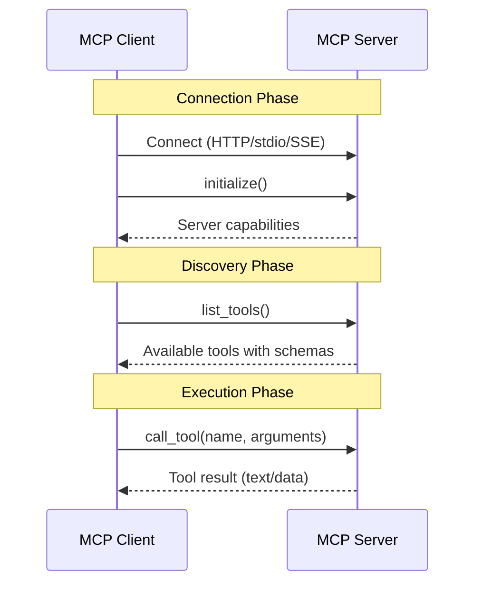

The protocol is simple:
1. **Connect** — establish communication
2. **Discover** — ask "what tools do you have?"
3. **Execute** — call a specific tool with arguments and get results

---

## How Coffee Shop Implements MCP

Our **observability-chat** service is the **MCP Host + Client**. It connects to **4 MCP Servers**:

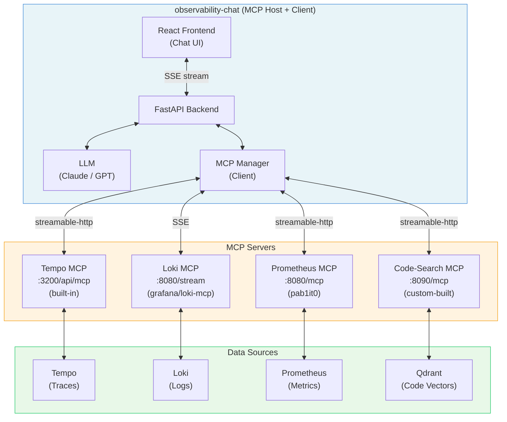

### MCP Server Configuration

```json
[
  {"name": "tempo",       "url": "http://tempo:3200/api/mcp"},
  {"name": "loki",        "url": "http://loki-mcp:8080/stream"},
  {"name": "prometheus",  "url": "http://prometheus-mcp:8080/mcp"},
  {"name": "code-search", "url": "http://code-search:8090/mcp"}
]
```

### Tool Namespacing

When multiple MCP servers have tools, names could collide. Our app solves this with **namespacing**:

```
tempo__traceql-search          → calls "traceql-search" on Tempo
loki__loki_query               → calls "loki_query" on Loki
prometheus__execute_query      → calls "execute_query" on Prometheus
code-search__search_code       → calls "search_code" on Code-Search
```

The LLM sees all tools from all servers in one flat list, prefixed with `[server_name]` in descriptions.

---

## MCP Server: Tempo (Traces)

Tempo has a **built-in MCP server** (enabled in config). No separate container needed.

```yaml
# tempo.yml
query_frontend:
  mcp_server:
    enabled: true
```

### Tools Available
- `traceql-search` — execute TraceQL queries to find traces
- `get-trace` — fetch a specific trace by ID
- `get-attribute-names` — discover available trace attributes
- `get-attribute-values` — list values for a given attribute
- `docs-traceql` — get TraceQL syntax documentation
- `traceql-metrics-instant` / `traceql-metrics-range` — compute metrics from traces

### How a Trace Query Works

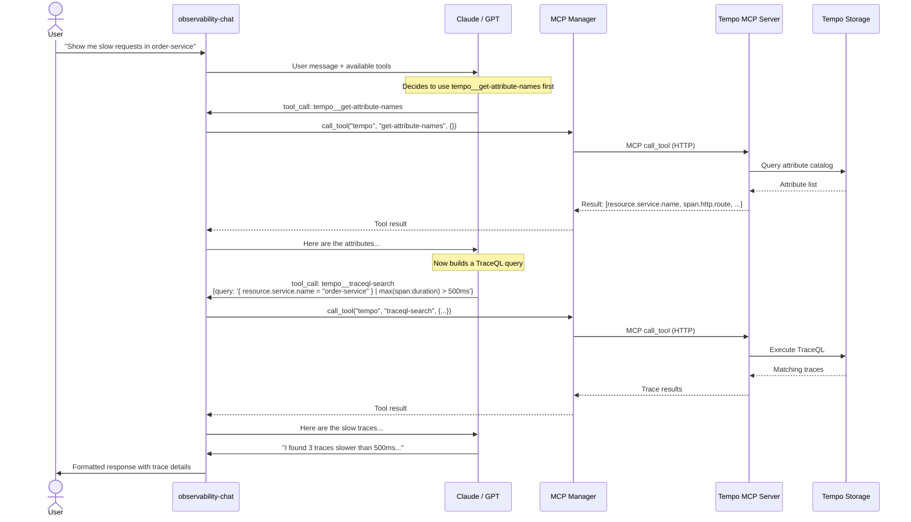

---

## MCP Server: Loki (Logs)

Loki MCP runs as a **separate container** (`grafana/loki-mcp`) that bridges MCP protocol to Loki's API.

### Tools Available
- `loki_query` — execute LogQL queries
- `loki_label_names` — discover available log labels
- `loki_label_values` — list values for a label

### How a Log Query Works

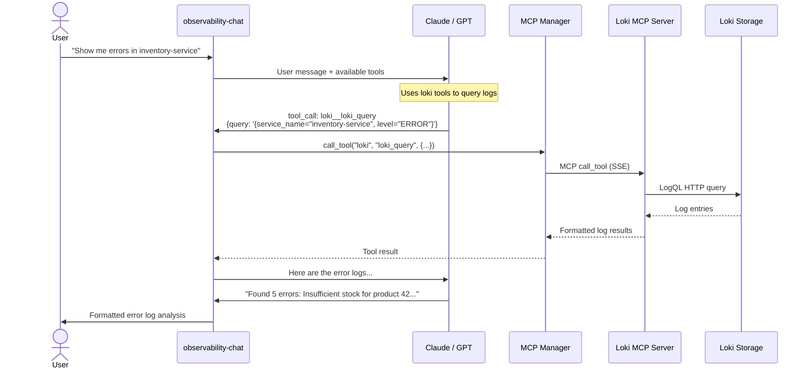

---

## MCP Server: Prometheus (Metrics)

Prometheus MCP runs as a **separate container** (`pab1it0/prometheus-mcp-server`) bridging MCP to Prometheus.

### Tools Available
- `execute_query` — run PromQL instant queries
- `execute_range_query` — run PromQL range queries
- `get_metric_metadata` — discover available metrics
- `get_targets` — list scrape targets

### How a Metrics Query Works

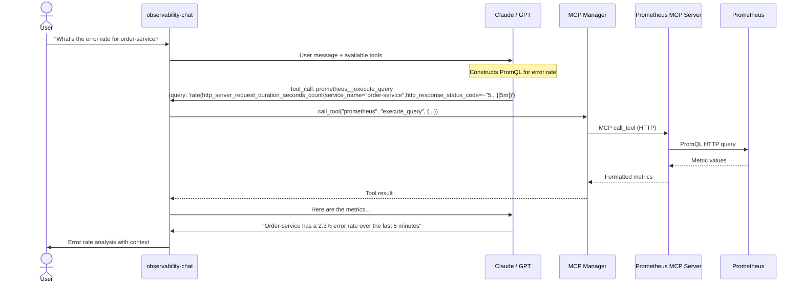

---

## MCP Server: Code-Search (Custom Built)

Code-Search is a **custom MCP server** built specifically for this app. It provides **semantic code search** across all microservices — the AI can search and read code to understand the system.

### Architecture

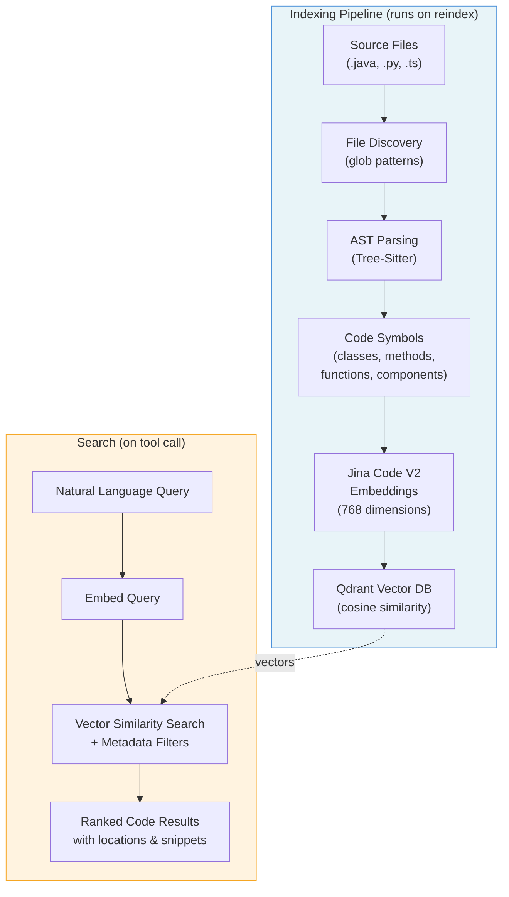

### What Gets Indexed

The code-search service parses source code using **Tree-Sitter** (the same AST parser used in VS Code, Neovim, GitHub) to extract meaningful symbols:

| Language | Symbols Extracted | Special Detection |
|----------|-------------------|-------------------|
| **Java** | Classes, interfaces, enums, records, methods | Spring stereotypes, HTTP routes, Lombok |
| **Python** | Classes, functions | Pydantic models, FastAPI routes, async |
| **TypeScript** | Functions, interfaces, types, components | React components, hooks, memo |

### Indexed Services

```yaml
# config.yaml
services:
  - catalog-service   (Java)
  - order-service     (Java)
  - inventory-service (Java)
  - observability-chat (Python + TypeScript)
```

### 7 Tools Exposed

| Tool | Purpose |
|------|---------|
| `search_code` | Semantic search — "find order placement logic" |
| `find_symbol` | Lookup by name — "find OrderService class" |
| `find_usages` | Find references — "who calls placeOrder?" |
| `get_code_context` | Read full source file or symbol |
| `reindex` | Rebuild the search index |
| `list_indexed_services` | Show indexed services and stats |
| `index_stats` | Show vector DB statistics |

### Indexing Flow (Detailed)

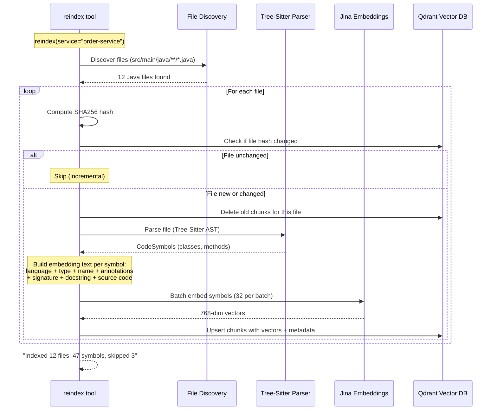

### Search Flow (Detailed)

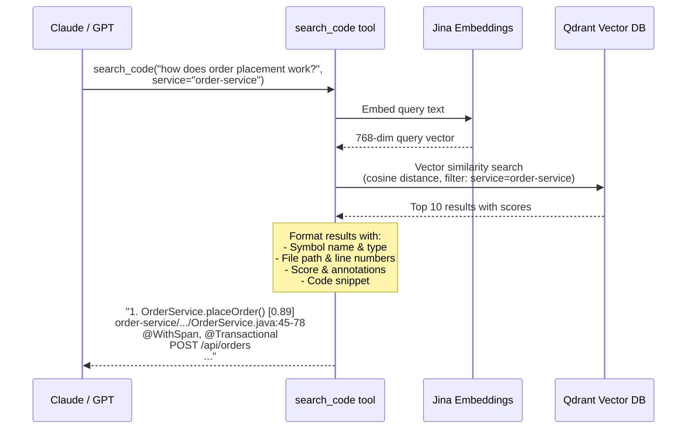

### Why Code-Search Matters

When the AI finds a bug through traces/logs, it can **immediately look at the code** to understand why:

1. Tempo says: "order-service errors on POST /api/orders"
2. Loki says: "NullPointerException in OrderService.placeOrder"
3. Code-Search says: "Here's the placeOrder method — line 67 accesses product.getPrice() without null check"

**The AI connects the dots that would take a developer minutes of clicking through Grafana, grep-ing code, and reading stack traces.**

---

# Part 3: AI Agents

---

## Chatbot vs. AI Agent

| | Chatbot | AI Agent |
|---|---------|----------|
| **Input** | User message | User message |
| **Process** | Generate one response | Reason, use tools, iterate |
| **Tools** | None | Yes — can call external systems |
| **Iterations** | 1 | Multiple (loops until done) |
| **Output** | Static text | Informed answer after investigation |

A **chatbot** gives you its best guess from training data.
An **agent** goes and **looks things up** before answering.

---

## The Agent Loop in Our App

The core of our observability-chat is an **agent loop** — the AI doesn't just respond, it thinks, acts, observes, and repeats.

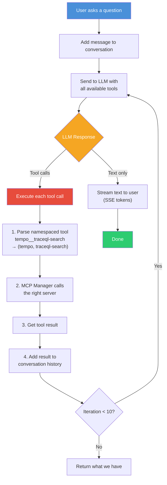

### Key Details
- **Max 10 iterations** — safety limit to prevent infinite loops
- **Streaming** — text tokens are streamed to the UI in real-time via SSE (Server-Sent Events)
- **Multi-provider** — supports both Claude (Anthropic) and GPT (OpenAI)
- **Conversation memory** — the full history (including tool results) is sent to the LLM each iteration

---

## The Agent Loop — Sequence Diagram

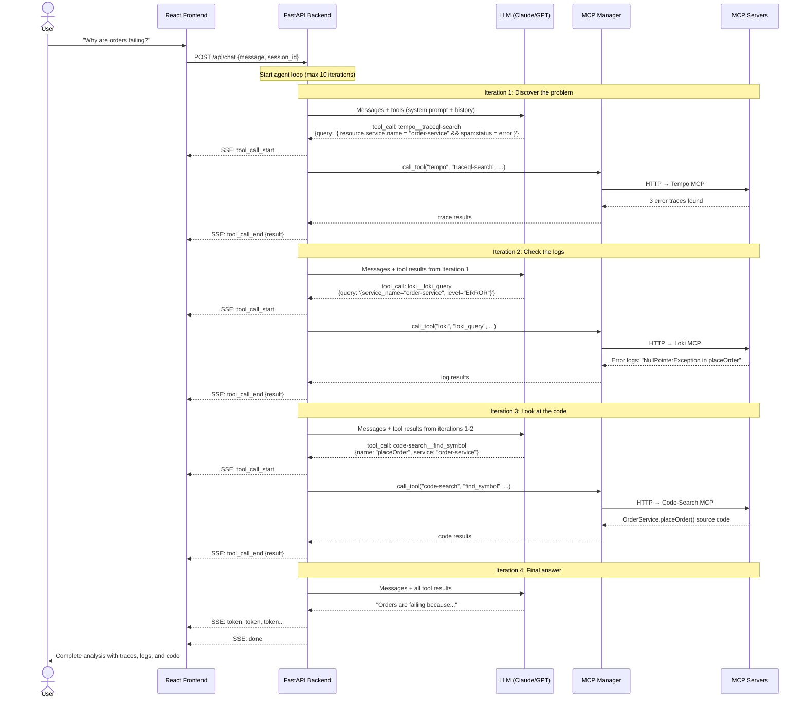

---

## Why This Matters: Fast Bug Finding

### Traditional Debugging Flow (Manual)

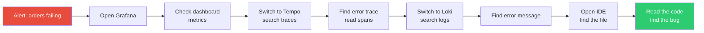

**Time: 10-30 minutes** of switching between tools, copy-pasting trace IDs, grep-ing code.

### AI Agent Debugging Flow

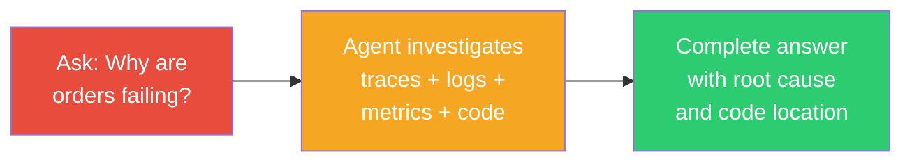

**Time: 30-60 seconds.** The AI does the same investigation a developer would, but in parallel and without context-switching.

### The Key Insight

The power isn't in any single component — it's in the **combination**:

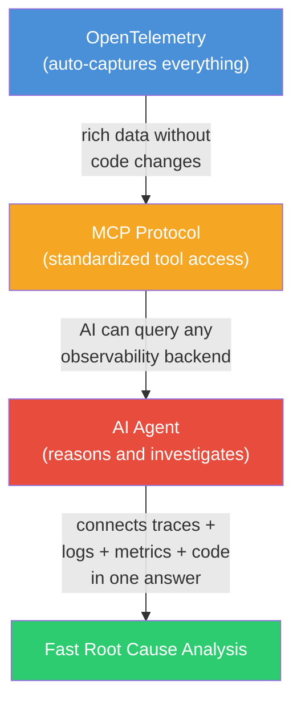

1. **OTEL** captures rich telemetry with zero code changes
2. **MCP** gives the AI standardized access to all that data
3. **The Agent** reasons across all signals to find the root cause

---

## Full System Architecture

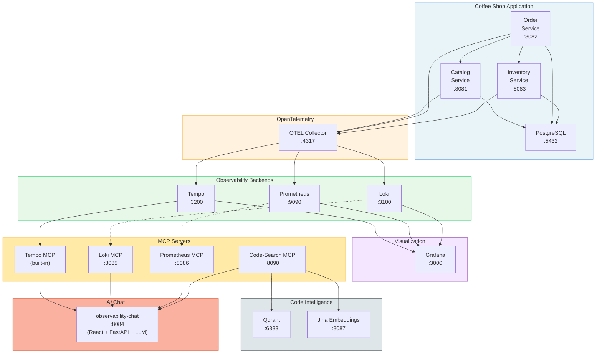

---

## Summary

| Layer | Technology | Purpose |
|-------|-----------|---------|
| **Instrumentation** | OTEL Java Agent | Auto-capture traces, metrics, logs |
| **Collection** | OTEL Collector | Route signals to the right backend |
| **Storage** | Tempo, Prometheus, Loki | Store traces, metrics, logs |
| **Visualization** | Grafana | Dashboards, cross-signal correlation |
| **AI Access** | MCP Protocol | Standardized tool interface for AI |
| **AI Reasoning** | Agent Loop (Claude/GPT) | Multi-step investigation |
| **Code Intelligence** | Code-Search + Qdrant | Semantic code search |

**The result:** Ask a question in plain English, get a root-cause analysis that would normally take a developer 10-30 minutes of manual investigation.
